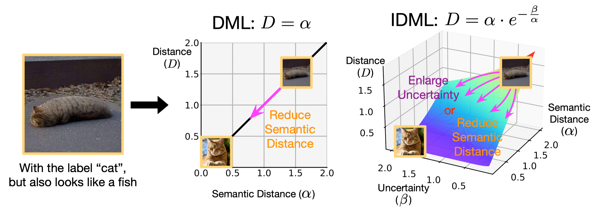
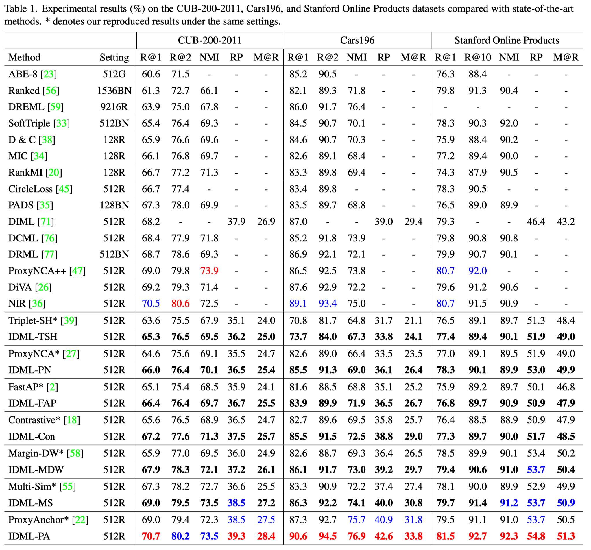

# [TPAMI 2023] Introspective Deep Metric Learning

This repository is the official implementation of our paper:

>  Introspective Deep Metric Learning
>
>  Chengkun Wang\*, [Wenzhao Zheng\*](https://scholar.google.com/citations?user=LdK9scgAAAAJ&hl=en), [Zheng Zhu](http://www.zhengzhu.net/), [Jie Zhou](https://scholar.google.com/citations?user=6a79aPwAAAAJ&hl=en&authuser=1), and [Jiwen Lu](http://ivg.au.tsinghua.edu.cn/Jiwen_Lu/)
>
>  IEEE Transactions on Pattern Analysis and Machine Intelligence (T-PAMI), 2023

### [Paper](https://arxiv.org/pdf/2309.09982)

## Introduction

This paper proposes an introspective deep metric learning (IDML) framework for uncertainty-aware comparisons of images. Conventional deep metric learning methods produce confident semantic distances between images regardless of the uncertainty level. However, we argue that a good similarity model should consider the semantic discrepancies with caution to better deal with ambiguous images for more robust training. To achieve this, we propose to represent an image using not only a semantic embedding but also an accompanying uncertainty embedding, which describe the semantic characteristics and ambiguity of an image, respectively. We further propose an introspective similarity metric to make similarity judgments between images considering both their semantic differences and ambiguities. Our framework attains state-of-the-art performance on the widely used CUB-200-2011, Cars196, and Stanford Online Products datasets.

## Motivation



For a semantically ambiguous image, conventional DML explicitly reduces its distance with other intraclass images unaware of the uncertainty.
Differently, the proposed introspective similarity metric provides an alternative way to enlarge the uncertainty level to allow confusion in the network.  

## Performance



## Datasets 

The datasets should be organized in the data folder.

### CUB-200-2011

Download from [here](http://www.vision.caltech.edu/visipedia/CUB-200-2011.html).

Organize the dataset as follows:

```
- CUB_200_2011
    |- images
    |   |- 001.Black_footed_Albatross
    |   |   |- Black_Footed_Albatross_0001_796111
    |   |   |- ...
    |   |- ...
```

### Cars196

Download from [here](http://ai.stanford.edu/~jkrause/cars/car_dataset.html).

Organize the dataset as follows:

```
- cars196
    |- car_ims
    |   |- image000001
    |   |- ...
    |- cars_annos.mat
```

### Stanford Online Products

Download from [here](http://cvgl.stanford.edu/projects/lifted_struct/)

Organize the dataset as follows:

```
- Standford_Online_Products
    |- bicycle_final
    |   |- image0
    |   |- ...
    |- ...
    |- Ebay_train.txt
    |- Ebay_test.txt
```

## Requirements

- Python3
- PyTorch (>1.0)
- NumPy
- wandb

## Training

We provide the training settings of our IDML framework with the ProxyAnchor loss on three datasets, which achieves state-of-the-art performances compared with previous methods.

### CUB-200-2011

To train the proposed IDML framework using the ProxyAnchor loss on CUB200 in the paper, run this command:

```
CUDA_VISIBLE_DEVICES=0,1,2,3 python train.py \
--gpu -1 \
--loss Proxy_Anchor \
--model resnet50 \
--embedding-size 512 \
--batch-size 120 \
--lr 6e-4 \
--dataset cub \
--warm 5 \
--bn-freeze 1 \
--lr-decay-step 5
```

| Method  | Backbone  | R@1  | R@2  | R@4  | NMI  |  RP  | MAP@R |
| :-----: | :-------: | :--: | :--: | :--: | :--: | :--: | :---: |
| IDML-PA | ResNet-50 | 70.7 | 80.2 | 87.9 | 73.5 | 39.3 | 28.4  |

### Cars196

To train the proposed IDML framework using the ProxyAnchor loss on CUB200 in the paper, run this command:

```
CUDA_VISIBLE_DEVICES=0,1,2,3 python train.py \
--gpu -1 \
--loss Proxy_Anchor \
--model resnet50 \
--embedding-size 512 \
--batch-size 120 \
--lr 2.5e-4 \
--dataset cars \
--warm 5 \
--bn-freeze 1 \
--lr-decay-step 10
```

| Method  | Backbone  | R@1  | R@2  | R@4  | NMI  |  RP  | MAP@R |
| :-----: | :-------: | :--: | :--: | :--: | :--: | :--: | :---: |
| IDML-PA | ResNet-50 | 90.6 | 94.5 | 97.1 | 76.9 | 42.6 | 33.8  |

### Stanford_Online_Products

To train the proposed IDML framework using the ProxyAnchor loss on SOP in the paper, run this command:

```
CUDA_VISIBLE_DEVICES=0,1,2,3 python train.py \
--gpu -1 \
--loss Proxy_Anchor \
--model resnet50 \
--embedding-size 512 \
--batch-size 120 \
--lr 6e-4 \
--dataset SOP \
--warm 5 \
--bn-freeze 1 \
--lr-decay-step 10 \
--lr-decay-gamma 0.25
```

| Method  | Backbone  | R@1  | R@10 | NMI  |  RP  | MAP@R |
| :-----: | :-------: | :--: | :--: | :--: | :--: | :---: |
| IDML-PA | ResNet-50 | 81.5 | 92.7 | 92.3 | 54.8 | 51.3  |

## Device 

We tested our code on a Linux machine with 8 Nvidia RTX 2080ti GPU cards. 

## Acknowledgment

Our code is based on [ProxyAnchor](https://github.com/tjddus9597/Proxy-Anchor-CVPR2020).

## Extension to Image Classification

Our framework can be readily extended to image classification. We followed the setting of [CutMix](https://github.com/clovaai/CutMix-PyTorch) and conducted experiments on the ImageNet-1K, CIFAR-10, and CIFAR-100 datasets, which shows that equipping existing data mixing methods with the proposed introspective metric consistently achieves better results (e.g., +0.44% for CutMix on ImageNet-1K).

#### ImageNet-1K

| Methods          | Backbone      | Top-1 Acc         | Top-5 Acc         |
| ---------------- | ------------- | ----------------- | ----------------- |
| Baseline         | ResNet-50     | 76.32             | 92.95             |
| **ISM-Baseline** | **ResNet-50** | **76.94 (+0.62)** | **93.24 (+0.29)** |
| Mixup            | ResNet-50     | 77.42             | 93.60             |
| **IDML-Mixup**   | **ResNet-50** | **77.95 (+0.53)** | **93.93 (+0.33)** |
| Cutmix           | ResNet-50     | 78.60             | 94.08             |
| **IDML-Cutmix**  | **ResNet-50** | **79.04 (+0.44)** | **94.47 (+0.39)** |

#### Cifar 100
| Methods          | Backbone      | Top-1 Acc         | Top-5 Acc         |
| ---------------- | ------------- | ----------------- | ----------------- |
| Baseline         | ResNet-50     | 83.55             | 96.31             |
| **ISM-Baseline** | **ResNet-50** | **84.08 (+0.53)** | **96.46 (+0.17)** |
| Mixup            | ResNet-50     | 84.22             | 95.96             |
| **IDML-Mixup**   | **ResNet-50** | **84.59 (+0.37)** | **96.79 (+0.83)** |
| Cutmix           | ResNet-50     | 85.53             | 97.03             |
| **IDML-Cutmix**  | **ResNet-50** | **85.65 (+0.12)** | **97.21 (+0.18)** |

#### Cifar 10
| Methods          | Backbone      | Top-1 Acc         |
| ---------------- | ------------- | ----------------- |
| Baseline         | ResNet-50     | 96.15             |
| **ISM-Baseline** | **ResNet-50** | **96.43 (+0.28)** |
| Mixup            | ResNet-50     | 96.91             |
| **IDML-Mixup**   | **ResNet-50** | **97.13 (+0.22)** |
| Cutmix           | ResNet-50     | 97.12             |
| **IDML-Cutmix**  | **ResNet-50** | **97.32 (+0.20)** |


## Citation

If you find this project useful in your research, please cite:

````
@article{wang2023introspective,
    title={Introspective Deep Metric Learning},
    author={Wang, Chengkun and Zheng, Wenzhao and Zhu, Zheng and Zhou, Jie and Lu, Jiwen},
    journal={TPAMI},
    year={2023}
}
````
