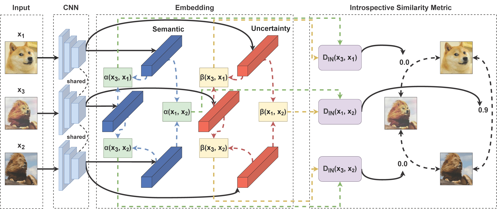

# Introspective Deep Metric Learning

This repository is the official implementation of our paper:

>  Introspective Deep Metric Learning
>
> Chengkun Wang\*, [Wenzhao Zheng\*](https://scholar.google.com/citations?user=LdK9scgAAAAJ&hl=en), [Zheng Zhu](http://www.zhengzhu.net/), [Jiwen Lu](http://ivg.au.tsinghua.edu.cn/Jiwen_Lu/), and [Jie Zhou](https://scholar.google.com/citations?user=6a79aPwAAAAJ&hl=en&authuser=1)

## Introduction

This paper proposes an introspective deep metric learning (IDML) framework for uncertainty-aware comparisons of images. Conventional deep metric learning methods produce confident semantic distances between images regardless of the uncertainty level. However, we argue that a good similarity model should consider the semantic discrepancies with caution to better deal with ambiguous images for more robust training. To achieve this, we propose to represent an image using not only a semantic embedding but also an accompanying uncertainty embedding, which describe the semantic characteristics and ambiguity of an image, respectively. We further propose an introspective similarity metric to make similarity judgments between images considering both their semantic differences and ambiguities. Our framework attains state-of-the-art performance on the widely used CUB-200-2011, Cars196, and Stanford Online Products datasets for image retrieval. We further evaluate our framework for image classification on the ImageNet-1K, CIFAR-10, and CIFAR-100 datasets, which shows that equipping existing data mixing methods with the proposed introspective metric consistently achieves better results (e.g., +0.44% for CutMix on ImageNet-1K).

